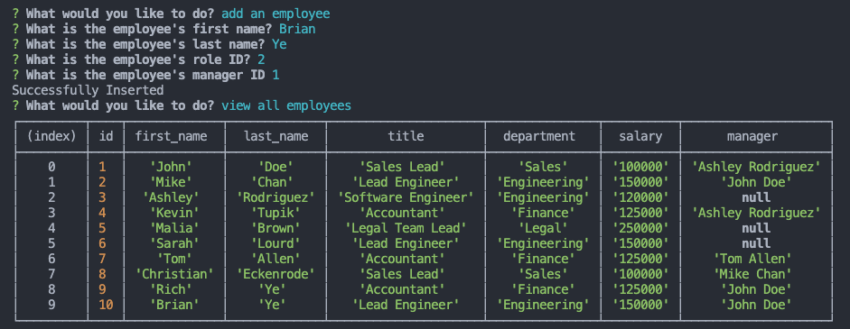
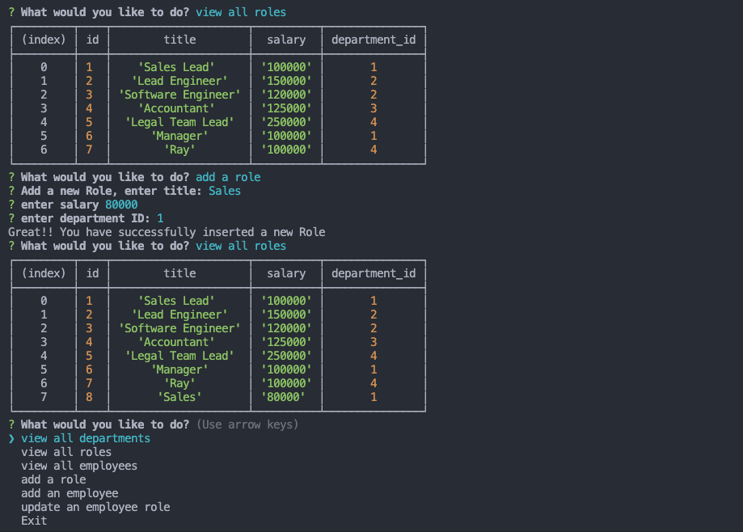
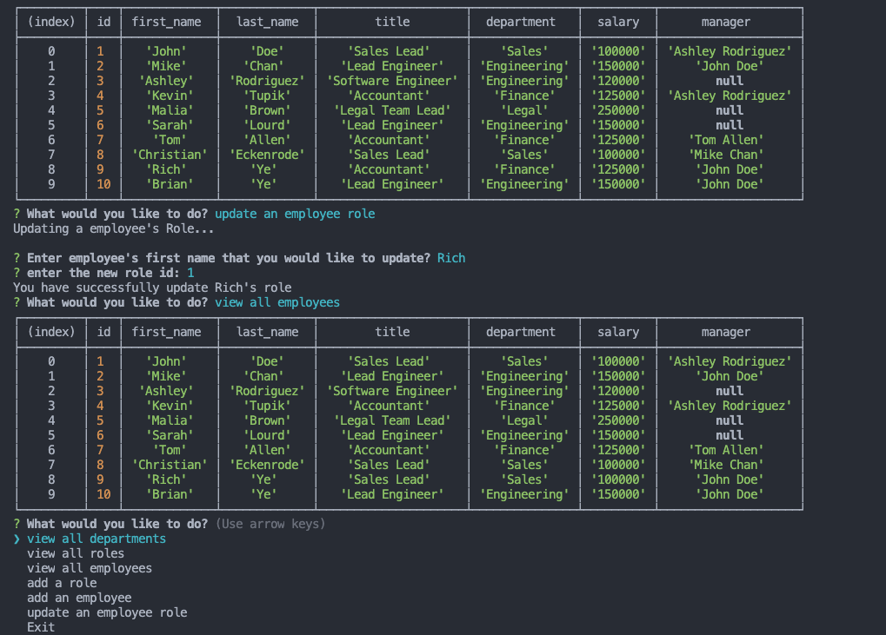

# Employee-Tracker

Build a command-line application to manage a company's employee database.
Create an interfaces that make it easy for non-developers to view and interact with information stored in databases. These interfaces are called content management systems (CMS)

## Video Demo

https://www.youtube.com/watch?v=L5nt_MvG9K4&ab_channel=rongbangye

## Add Employee/View All Employees

## Add Role

## Update Employee

## Tech Stacks for this App

Node.js, Inquirer, and MySQL.

## Installation

1. Clone this repo or download zip
2. install npm: npm install
3. run the app: node start
